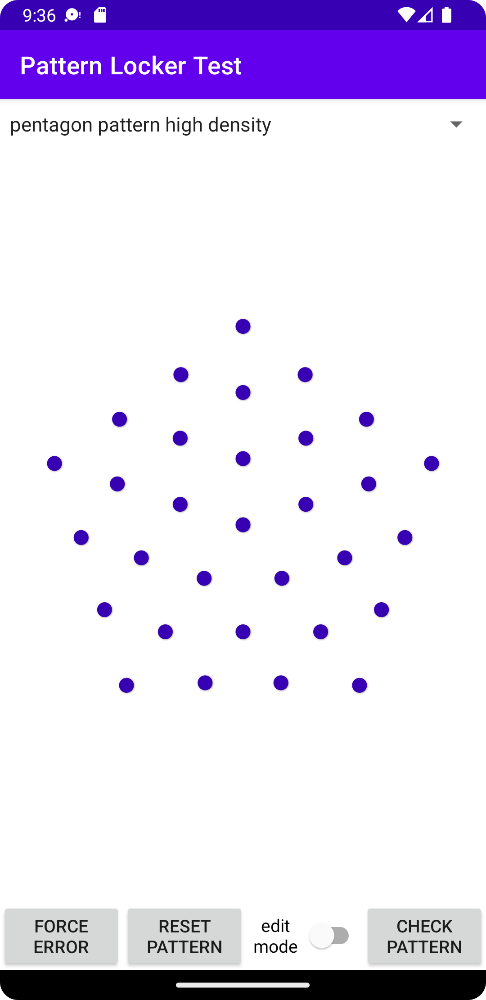
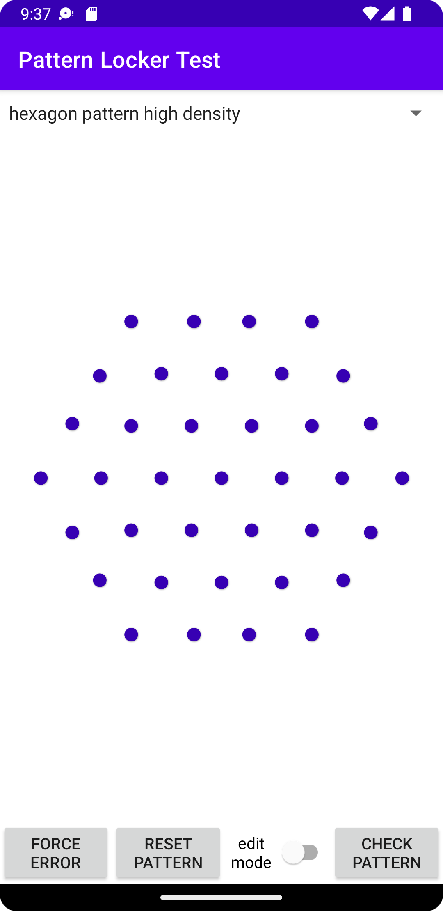

# android_pattern_locker
Pattern Locker Library for android

<div>



</div>
<div>
</div>

---------
<!-- -->


# How TO APPLY

## 1. Import this lib to your project
1. add jitpack in your 'settings.gradle'

    ```
    dependencyResolutionManagement {
        ...
        repositories {
            ...
            maven { url 'https://jitpack.io' }
        }
        ...
    }
    ```

2. add dependencies in your 'app/build.gradle'
    ```
    dependencies {
        implementation 'com.github.imscs21:android_pattern_locker:v0.3.0'
        ...
    }
    ```


## 2. In XML
```
<com.github.imscs21.pattern_locker.views.PatternLockView
        xmlns:android="http://schemas.android.com/apk/res/android"
        xmlns:app="http://schemas.android.com/apk/res-auto"
        android:layout_width="match_parent"
        android:layout_height="match_parent"
        android:padding="30dp"
        app:recommendedClickingJudgementAreaPaddingRadius="9dp"
        app:spacingSizeIfWrapContent="100dp"
        app:spacingTypeIfWrapContent="total"
        app:indicatorColor="#80ff80"
        app:indicatorErrorColor="#F45079"
        app:indicatorRadius="6dp"
        app:trajectoryLineColor="#ff8080"
        app:trajectoryLineErrorColor="#F38BA0"
        app:trajectoryLineThickness="5dp"
        app:showTrajectoryLines="true"
        app:useVibratorIfAvailable="true"
        app:useTrajectoryLineShadow="false"
        app:patternType="hexagon_shape_default" />
```
* xml attributes
    1. (supported) pattern types
        * square_3x3
        * square_3x3_with_checker_pattern
        * square_4x4
        * square_5x5
        * square_6x6
        * square_7x7
        * pentagon_shape_default
        * pentagon_shape_with_high_density
        * hexagon_shape_default
        * hexagon_shape_with_high_density
    2. spacingTypeIfWrapContent
       * total
       * fixed 
    3. etc

## 3. In Kotlin

```
//patternLockView = PatternLockView(context) //for initiate view in code

//setting attributes in code
patternLockView.useVibratorIfAvaliable = false
patternLockView.useTrajectoryLineShadow = false
patternLockView.shouldShowTrajectoryLines = false
patternLockView.setLockTypes(PatternLockView.LockType.SQUARE_3X3,invalidateView = true)
patternLockView.clickingJudgementPaddingRadius = 30f//dimension size(e.g. pixel size)
patternLockView.editMode = true // not using currently
patternLockView.onTaskPatternListener = ...

//finish setting attributes in code

val patternDataContoller = PatternLockerDataController.PatternLockerDataControllerFactory.getInstance().build<String>(this,PatternLockerDataController.SimpleDataStorageBehavior(this))
        patternDataContoller.onCheckingSelectedPointsListener = object:PatternLockerDataController.OnCheckingSelectedPointsListener{
            override fun onError(errorID: Int) {
                patternLockView.resetSelectedPoints(force = true)
            }

            override fun onSuccess(result: Boolean) {
                runOnUiThread {
                    Toast.makeText(applicationContext,"check result is ${result}",Toast.LENGTH_SHORT).show()
                    patternLockView.resetSelectedPoints(force = true)
                }
            }
        }
patternLockView.onTaskPatternListener = object:PatternLockView.OnTaskPatternListener{
            override fun onNothingSelected() {

            }

            override fun onFinishedPatternSelected(
                view:PatternLockView,
                editModeFromView: Boolean,
                lockType: PatternLockView.LockType,
                copiedSelectedPoints: ArrayList<SelectedPointItem>
            ) {
                if(editModeButton.isChecked){
                    //in pattern edit mode
                }
                else{
                    patternDataContoller.requestToCheckSelectedPoints(lockType, copiedSelectedPoints)
                }
            }

        }
```

#### 3.0. Hierarchical relation of pattern points instance
```
Position = Pair<Float,Float>//x,y position values


PointItem = Pair<Int,Position>//pointID(index)number,Point Position

SelectedPointItem = Pair<Long,PointItem>//task time order id(sequence id),PointItem

points = ArrayList<PointItem>

selectedPoints = ArrayList<SelectedPointItem>
```

#### 3.1. Implement your own pattern storage behavior
```
val dataControllerFactory = PatternLockerDataController.PatternLockerDataControllerFactory.getInstance()

val dataStorageBehavior : PatternLockerDataController.DataStorageBehavior<Any> = object:PatternLockerDataController.DataStorageBehavior<Any>{
    override val innerValue: MutableLiveData<Any>
        get() = TODO("Not yet implemented")

    override fun selectValue(): Any? {
        TODO("Not yet implemented")
    }

    override fun savePattern(
        lockType: PatternLockView.LockType,
        selectedPoints: ArrayList<SelectedPointItem>
    ): Boolean {
        TODO("Not yet implemented")
    }

    override fun loadPattern(): Any? {
        TODO("Not yet implemented")
    }

    override fun checkPattern(
        value: Any?,
        lockType: PatternLockView.LockType,
        selectedPoints: ArrayList<SelectedPointItem>
    ): Boolean {
        TODO("Not yet implemented")
    }

    override fun resetPattern(): Boolean {
        TODO("Not yet implemented")
    }

}

val dataController = dataControllerFactory.build(context,dataStorageBehavior)
...

```

#### 3.2. Simple Data Storage Behavior 
This is pre-defined StorageBehavior.    
But There are weak points due to md5 hashing. 
```
val simpleBehavior = PatternLockerDataController.SimpleDataStorageBehavior(this)
val dataControllerFactory = PatternLockerDataController.PatternLockerDataControllerFactory.getInstance()
val patternDataContoller = dataControllerFactory.build<String>(this,simpleBehavior)
```

#### 3.3. Implement your own index number

```
patternLockView.apply {
    onCalculateCustomPointOfPatternListener = object : PatternLockView.OnCalculateCustomIndexOfPointOfPatternListener{
        override fun getPointIndex(originalIndex: Int, pointPosition: Position): Int {
            //this is example of custom index
            //returned value must be positive integer.
            val useCustomIndex:Boolean = true
            if(useCustomIndex){
                return 2*originalIndex - 1
            }
            else{
                return originalIndex
            }
        }

    }
}
```

#### 3.4. Implement your own custom pattern shape
This can be available in only kotlin
```
patternLockView.apply {
    onCalculateCustomShapePositionListener =
        object : PatternLockView.OnCalculateCustomShapePositionListener {
            override fun onCalculateCustomShape(
                canvasWidth: Int,
                canvasHeight: Int,
                directCanvas: Canvas?,
                pointsOfPatternContainer: ArrayList<PointItem>,
                pointsOfPatternContainerMaxLength: UInt,
                pointRadius: Float,
                spacingValuesIfWrapContent: Pair<PatternLockView.SpacingTypeIfWrapContent, Float>,
                isPointContainerClearedBeforeThisMethod: Boolean,
                customParams: Any?
            ) {
                //this is example of custom shape
                val cx = canvasWidth / 2.0f
                val cy = canvasHeight / 2.0f
                pointsOfPatternContainer.add(PointItem(1, Position(cx, cy)))
                pointsOfPatternContainer.add(PointItem(2, Position(5*pointRadius, cy)))
                pointsOfPatternContainer.add(
                    PointItem(
                        3,
                        Position(canvasWidth - 5*pointRadius, cy)
                    )
                )
            }
            override fun getSpacingCount(): Int {
                        //per each axis of shape
                        return 2
            }
        }
    setLockTypes(PatternLockView.LockType.CUSTOM)
}
```


### 4. How to reset drawn pattern
```
patternLockView.resetSelectedPoints(force = true,invalidateView = true)
```

### 5. How to reset stored pattern info
```
patternDataContoller?.resetPattern()
```

### 5. How to use error indicator
```
patternLockView.apply {
    isReadOnlyMode = true
    patternLockView.turnErrorIndicator(
        true,
        invalidateView = true,
        semiAutoTurningOffMills = 4000
    )
    onTurnOffErrorIndicatorListener =
        object : PatternLockView.OnTurnOffErrorIndicatorListener {
            override fun onTurnOff(view: PatternLockView, fromDelayedTime: Boolean) {
                if (fromDelayedTime) {
                    view.isReadOnlyMode = false
                }
            } 
        }
}
```